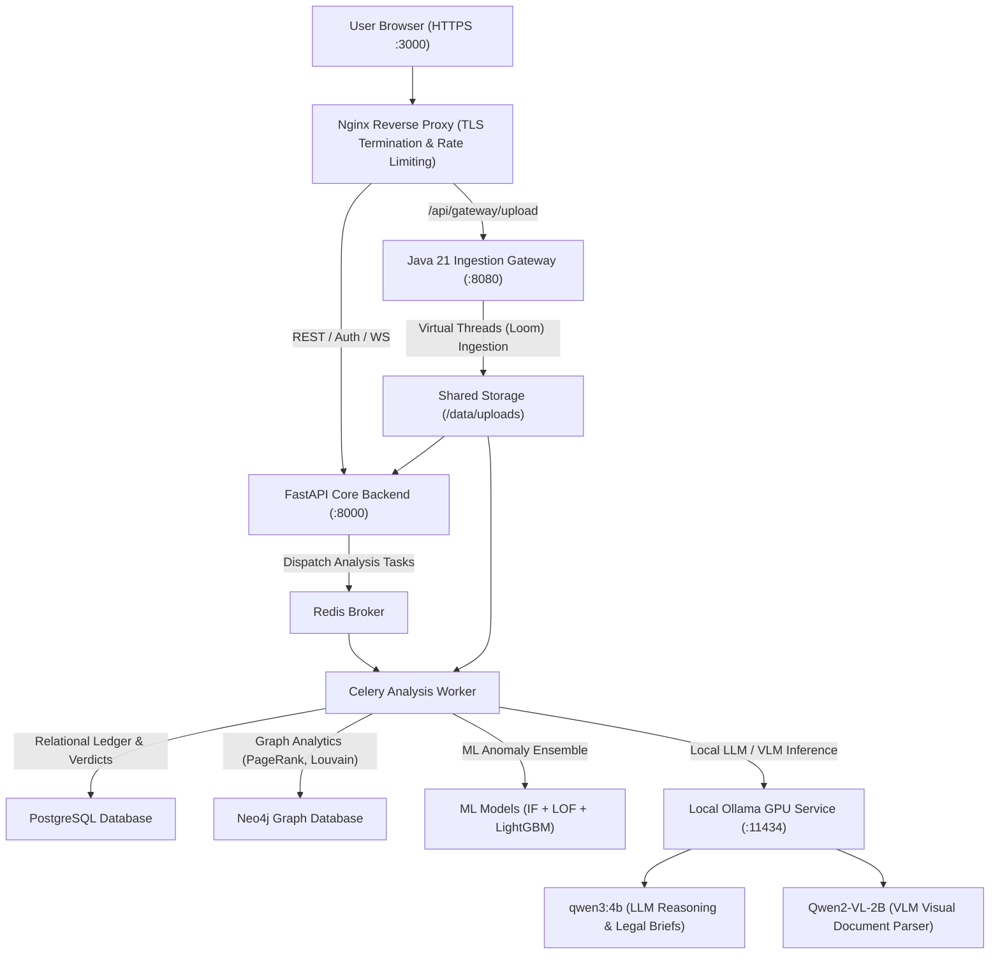

# FinFlow - Forensic Bank Statement Analysis System
**Karnataka CID Economic Offences Wing (EOW) - Internal Tool**

A full-stack forensic analysis platform for detecting financial crimes (money laundering, structuring, pass-through mule networks) from bank statement CSVs. Powered by a 3-model ML ensemble, interactive D3.js & Cytoscape.js graph analytics, LLM second opinions, and an AI chat assistant.

---

## Table of Contents
1. [Architecture Overview](#architecture-overview)
2. [Microservices Infrastructure](#microservices-infrastructure)
3. [Prerequisites](#prerequisites)
4. [Quick Start & Deployment](#quick-start--one-command-setup)
5. [Uploading & Case Analysis](#uploading--analysing-cases)
6. [Supported Banks & Dynamic Generic Parsing](#supported-banks--dynamic-generic-parsing)
7. [Repository Structure](#repository-structure)
8. [Dual Local AI Engine Setup (Ollama VLM & LLM)](#dual-local-ai-engine-setup-ollama-vlm--llm)
9. [Analysis Pipeline & Fraud Typologies](#analysis-pipeline--fraud-typologies)
10. [System Diagnostics & Operations](#system-diagnostics--operations)
11. [Docker Services & Port Matrix](#docker-services--port-matrix)

---

## Architecture Overview



### Microservices Infrastructure

* **Java 21 Ingestion Gateway (`ingestion-gateway:8080`)**: Built on Java 21 (Spring Boot 3 + Project Loom / Virtual Threads) to handle ultra-high concurrency file uploads, multi-part document chunking, and instant SHA-256 integrity hashing without blocking I/O threads.
* **FastAPI Core Backend (`backend:8000`)**: Python 3.12 API engine managing case management, transactional data routes, Benford's Law analysis, rule engine processing, and live WebSocket broadcasts.
* **Celery Worker Engine (`worker`)**: Asynchronous distributed worker executing the ML anomaly ensemble, Neo4j graph algorithms, and local Ollama AI prompts.
* **ML Pipeline Ensemble**: 3-model hybrid fusion combining Isolation Forest (40%), LightGBM (35%), and Local Outlier Factor (25%).
* **Graph Analytics Engine**: Dual D3.js (Force-directed, Radial, Sankey flow) and Cytoscape.js localized neighborhood visualizers powered by Neo4j graph data.
* **Dual Local AI Engine (Ollama)**: Local GPU-accelerated inference pairing **Qwen2-VL-2B** (Visual document parsing) and **Qwen3-4B** (Reasoning, legal notice generation, and interactive case assistant).

---

## Prerequisites

| Tool | Version | Notes |
|------|---------|-------|
| Docker Desktop | ≥ 4.x | Must be running |
| Docker Compose | V2 (bundled with Docker Desktop) | Use `docker compose` not `docker-compose` |
| Git | Any | For cloning |
| OpenSSL | Any | For generating TLS cert (Git Bash has it on Windows) |

**No Python, Node, or database installation required**: everything runs in Docker.

---

## Quick Start & One-Command Setup

FinFlow comes with a fully automated setup script that handles TLS certificate generation, Neo4j plugin downloads, database migrations, spaCy model installation, synthetic data generation, ML model training, dynamic hash registration, and admin user creation.

### Option A: Automated Setup (Recommended)

**On Linux/Mac or Git Bash (Windows):**
```bash
./setup.sh
```

**For a completely non-interactive/silent setup (e.g. for CI/CD or Automated Deployment):**
```bash
NON_INTERACTIVE=true ./setup.sh
```

**On Windows (PowerShell):**
1. Run the setup script to download plugins and generate certs:
   ```powershell
   .\setup.ps1
   ```
2. Start the Docker containers:
   ```powershell
   docker compose up --build -d
   ```
3. Run migrations, train models, seed watchlist, and create admin user:
   ```powershell
   # Wait for databases to start, then run:
   docker compose exec backend alembic upgrade head
   docker compose exec backend python -m spacy download en_core_web_sm
   docker compose exec backend python scripts/generate_training_data.py
   docker compose exec backend python scripts/train_models.py
   docker compose exec backend python scripts/compute_hashes.py
   docker compose exec backend python scripts/seed_watchlist.py
   docker compose exec backend python -c "
   import asyncio
   from database import AsyncSessionLocal
   from security.auth import create_user
   async def main():
       async with AsyncSessionLocal() as db:
           await create_user(db, 'admin', 'admin123', 'Administrator', 'ADMIN-001', 'ADMIN')
   asyncio.run(main())
   "
   docker compose restart backend worker
   ```

### Option B: Manual Setup Step-by-Step

If you prefer to configure every component manually, follow these steps:

1. **Create .env:** Copy `.env.example` to `.env` and set secure passwords and a 64-char `SECRET_KEY`.
2. **Generate TLS Certificates:** Save certificates to `nginx/certs/server.crt` and `nginx/certs/server.key`.
3. **Download Neo4j GDS Plugin:** Download `neo4j-graph-data-science-2.6.8.jar` and place it in the `plugins/` directory.
4. **Launch Containers:** Run `docker compose up --build -d`.
5. **Run Database Migrations:** Run `docker compose exec backend alembic upgrade head`.
6. **Download NLP Model:** Run `docker compose exec backend python -m spacy download en_core_web_sm`.
7. **Generate Training Data & Train ML Models:**
   ```bash
   docker compose exec backend python scripts/generate_training_data.py
   docker compose exec backend python scripts/train_models.py
   docker compose exec backend python scripts/compute_hashes.py
   ```
   *Note: Model hashes are written automatically to `models/hashes.json` inside the mounted volume.*
8. **Seed Watchlist:** Run `docker compose exec backend python scripts/seed_watchlist.py`.
9. **Create Admin User:** Run the custom script to create your administrative account.

### Accessing the Application

> [!IMPORTANT]
> **Default Credentials for Evaluators & Judges:**
> * **Username:** `admin`
> * **Password:** `admin123`

1. Open your browser: **https://localhost:3000**
2. Click **Advanced → Proceed to localhost** to bypass the self-signed TLS certificate warning.
3. Login using the default credentials above.

---


## Uploading & Analysing Cases

1. **Create a Case** → Cases → New Case → fill in title, FIR number, etc.
2. **Upload Statements** → Case → Upload tab → drag and drop CSV files
   - Supports multiple files per case (multiple suspects/accounts)
   - Max file size: **500 MB per file**
3. **Run Analysis** → Case → Overview tab → click **Analyze**
   - Watch real-time progress on the progress bar
   - Takes 30 seconds to 5 minutes depending on transaction count
4. **Review Results** in tabs:
   - **Executive Summary**: AI-generated forensic narrative
   - **Verdicts**: Per-account risk scores with ML + LLM reasoning
   - **Graph**: Interactive D3.js network visualization (with force-directed, radial, and Sankey flow layouts) and localized Cytoscape.js suspect graphs
   - **Alerts**: Flagged transactions with evidence trails
   - **Transactions**: Multi-criteria search dashboard (filtering by date ranges, amount sliders, payment channels, and flag types)
   - **Money Trail**: Interactive split-screen visual ledger with credit-to-debit hover highlights
   - **Entities**: Extracted PANs, UPIs, phone numbers, IFSCs
   - **Hypothesis**: AI-driven hypothesis engine
   - **Ask AI**: Natural language query over case data
   - **Reports**: Generate PDF/Word officer briefs

---

## Supported Banks & Dynamic Generic Parsing

| Bank | Auto-detected | Parsing Method |
|------|--------------|----------------|
| SBI | ✅ Yes | Optimized Specific Parser |
| HDFC | ✅ Yes | Optimized Specific Parser |
| Axis | ✅ Yes | Optimized Specific Parser |
| Kotak | ✅ Yes | Optimized Specific Parser |
| IDFC | ✅ Yes | Optimized Specific Parser |
| ICICI | ✅ Yes | Dynamic Generic Pipeline |
| PNB | ✅ Yes | Dynamic Generic Pipeline |
| Canara | ✅ Yes | Dynamic Generic Pipeline |
| Union Bank | ✅ Yes | Dynamic Generic Pipeline |
| Yes Bank | ✅ Yes | Dynamic Generic Pipeline |
| **Any Other Bank** | ✅ Yes | Dynamic Generic Pipeline |

### The Dynamic Generic Statement Parser
For non-standard banks or files where specialized parsing fails, the system automatically falls back to our **Layout-Aware Generic Parser**.
1. **Dynamic Schema Inference**: Scans headers for keywords (e.g. date, particulars, debit, balance). If no header is found, it automatically analyzes cells in the first 100 rows to classify column roles (Date, Narration, Debit/Credit, Balance).
2. **Flexible Formats**: Works seamlessly on PDF, Excel (`.xlsx`, `.xls`), CSV, Docx, and images.
3. **Double-Entry Balance Verification**: Uses the running balance difference to correct transaction types (debit vs. credit) in case of ambiguous single-amount columns.

### OCR & Image Upload Fallback
*   **Scanned PDFs**: Automatically falls back to high-resolution Tesseract OCR.
*   **Direct Image Uploads**: Supports uploading `.png`, `.jpg`, `.jpeg`, `.tiff`, `.webp`, `.bmp` files directly.
*   **Layout-Aware Cell Grouping**: Rather than relying on simple line regexes, our OCR engine parses the Tesseract TSV output. It groups words into lines based on vertical overlap and merges adjacent text blocks into cells based on horizontal gaps, successfully reconstructing the tabular structure of the scanned document.

If auto-detection fails, use the **Bank Override** dropdown on upload.

**CSV / File Format Requirements:**
- Headers on row 1 (or detected automatically)
- Columns: Date, Narration/Description, Debit/Credit amounts, Balance
- Date formats: `DD/MM/YYYY`, `DD-MM-YYYY`, `YYYY-MM-DD` and other standard variations.

---

## Repository Structure

```
finflow/
├── backend/                  # FastAPI Core Application (Python 3.12)
│   ├── alembic/              # Database migration scripts (001 -> 004)
│   ├── config.py             # Settings via pydantic-settings, reads ../.env
│   ├── database.py           # Async SQLAlchemy database engine with fallback resolution
│   ├── engine/               # Rule engine, FIFO money trail, Benford's test, CUSUM
│   ├── entity/               # Entity extraction (UPI, IFSC, PAN, Account numbers)
│   ├── graph/                # Neo4j graph population and GDS algorithm runners
│   ├── llm/                  # Local Ollama client, prompt templates, and chat assistant
│   ├── ml/                   # Isolation Forest, LightGBM, and LOF ensemble logic
│   ├── parsers/              # Universal table parser, bank-specific parsers, and VLM parser
│   ├── routers/              # Modular API routers (cases, statements, analytics, auth)
│   └── tasks/                # Celery forensic analysis execution pipeline
├── frontend/                 # React Single Page Application (Vite / Tailwind CSS)
│   ├── src/
│   │   ├── api/              # Axios HTTP client with session authorization
│   │   ├── components/       # Graph visualizers, verdict panels, ledger, upload cards
│   │   ├── contexts/         # Authentication context (sessionStorage) and theme context
│   │   ├── hooks/            # WebSocket listeners and custom state hooks
│   │   └── pages/            # CaseDetailPage, CaseListPage, LoginPage, AdminPage
├── ingestion-gateway/        # High-Throughput Ingestion Service (Java 21 / Spring Boot 3)
│   ├── src/main/java/        # Virtual Thread file chunking, hashing, and stream controllers
│   └── pom.xml               # Maven configuration
├── models/                   # Serialized ML model artifacts (.joblib) and hash registry
├── nginx/                    # Reverse proxy configuration and TLS certificates
├── plugins/                  # Neo4j Graph Data Science (GDS) plugin binaries
├── scripts/                  # Synthetic data generator, model training, and admin provisioning
├── worker/                   # Celery analysis worker container definition
└── docker-compose.yml        # Multi-container service definitions
```

### Core Architectural Safeguards

1. **Deterministic Database URL Resolution**: `config.py` resolves the absolute path to `.env` relative to project root, and `database.py` seamlessly falls back to `config.get_settings().database_url` when executing outside containerized networking.
2. **Dynamic Task Execution Mode**: When running outside Docker (`/.dockerenv` absent), `celery_app.py` automatically activates `task_always_eager=True` for synchronous execution during local unit testing. Inside Docker, Redis coordinates task distribution.
3. **Graph Fallback Resilience**: `backend/graph/algorithms.py` queries Neo4j GDS first. If the graph database is unreachable, it automatically falls back to an internal relational graph projection, extracting counterparty accounts from narrations and determining edge directions directly from transaction types (`DR` / `CR`).
4. **Counterparty Graph Enrichment**: During forensic pipeline execution, extracted counterparty entities are reconciled and written back to the primary `transactions` ledger, ensuring real graph topology across all accounts.
5. **Cryptographic Model Hash Verification**: `backend/ml/model_loader.py` enforces SHA-256 integrity validation against `models/hashes.json` before loading serialized model artifacts into memory, preventing model poisoning or tampering.
6. **Air-Gapped Offline Inference**: `LLM_PROVIDER=ollama` strictly routes inference requests to the local host Ollama GPU daemon (`qwen3:4b` for forensic reasoning and `Qwen2-VL-2B` for document vision parsing). If Ollama is unavailable, `LLM_PROVIDER=template` provides offline deterministic template fallbacks. External cloud APIs are strictly disabled to guarantee zero data leakage.

---

## Dual Local AI Engine Setup (Ollama VLM & LLM)

To run FinFlow 100% offline using local GPU acceleration:

### Step 1: Download & Install Ollama
* **Windows**: Download installer from [ollama.com/download](https://ollama.com/download)
* **Mac**: Run `brew install ollama`
* **Linux**: Run `curl -fsSL https://ollama.com/install.sh | sh`

### Step 2: Download the Dual Local AI Models
Open your terminal and run these commands to download the models:

1. **Local Vision Model (Qwen2-VL)** for visual statement scanning:
   ```bash
   ollama pull hf.co/bartowski/Qwen2-VL-2B-Instruct-GGUF
   ```
2. **Local Reasoning LLM (Qwen3-4B)** for forensic case narratives & legal advice:
   ```bash
   ollama pull qwen3:4b
   ```

### Step 3: Start the Ollama Background Server
Run this command to start the Ollama server listening on port `11434`:
```bash
ollama serve
```
*(Or keep the Ollama Desktop App open in your system tray).*

### Step 4: Configure FinFlow `.env`
Ensure your `.env` file contains:
```env
LLM_PROVIDER=ollama
OLLAMA_URL=http://host.docker.internal:11434/api/chat
LLM_MODEL_OLLAMA=qwen3:4b
VLM_MODEL_OLLAMA=hf.co/bartowski/Qwen2-VL-2B-Instruct-GGUF
```

### Step 5: (Optional) Test Models Directly in Terminal
To chat with `qwen3:4b` directly in your terminal:
```bash
ollama run qwen3:4b
```

---

## Analysis Pipeline & Fraud Typologies

### 19-Stage Forensic Execution Pipeline

When **Analyze Case Now** is triggered, the background Celery worker executes:

```
1. File integrity check (SHA-256 hash verification)
2. Load transactions from DB
3. Balance validation (detect failed/reversed transactions)
4. Entity enrichment (parse counterparty accounts from narrations)
   └── Writes enriched counterparty_account back to transactions table
5. Watchlist check (flag known bad accounts)
6. Rule engine (structuring, round-trip, velocity spike, etc.)
7. FIFO money trail tracing
8. Graph population → Neo4j (or SQL if Neo4j unavailable)
9. Graph algorithms (PageRank, Louvain community detection)
10. Risk taint propagation (personalized PageRank from watchlist seeds)
11. Benford's Law chi-square test
12. Narration similarity clustering (detect coordinated transactions)
13. CUSUM change-point detection (detect behavioral regime changes)
14. ML ensemble scoring (IF + LOF + LightGBM per transaction)
15. Risk fusion (composite score per account)
16. LLM second opinion (top-risk accounts reviewed by local AI)
17. Verdict fusion (algorithmic verdict + LLM verdict → consensus tier)
18. Save results (verdicts, alerts, money trail, narration clusters)
19. Generate executive summary (local LLM narrative & legal briefs)
```

### Forensic Rules & Typologies Detected

| Rule Identifier | Typology Description |
|:---|:---|
| `STRUCTURING` | Amounts systematically calibrated just below reporting thresholds (e.g. ₹50,000 / ₹10,00,000). |
| `RAPID_MOVEMENT` | Pass-through mule behavior where credits are forwarded to other destinations within hours. |
| `CIRCULAR_FLOW` | Round-trip fund loops where money returns to origin via intermediary hops. |
| `VELOCITY_SPIKE` | Transaction frequency exceeding 10x normal baseline within a rolling 72-hour window. |
| `DORMANT_ACTIVATION` | Accounts inactive for extended durations that suddenly process high-value inflows. |
| `FAN_OUT` | One primary source account dispersing funds into multiple recipient accounts in a single day. |
| `WATCHLIST_HIT` | Exact match against seeded economic offender lists, sanctions, or designated watchlists. |
| `FAILED_TXN_ABUSE` | Repeated failed micro-transactions preceding high-value transfers (channel probing behavior). |
| `ML_ANOMALY_IF` | Multi-dimensional statistical outlier identified by the trained Isolation Forest model. |
| `CUSUM_BREAK` | Statistically significant structural shift in account behavioral pattern. |
| `OFF_HOURS_LARGE` | High-value transfers executed during unusual nocturnal windows (2:00 AM - 4:30 AM). |

---

## System Diagnostics & Operations

### Container Health Status

To verify all system containers are operational:
```bash
docker compose ps
```
All services (`nginx`, `backend`, `worker`, `ingestion-gateway`, `postgres`, `neo4j`, `redis`) should show `running` or `healthy`.

### Inspecting Service Logs

```bash
# Monitor all logs in real time
docker compose logs -f

# Monitor specific components
docker compose logs -f backend            # FastAPI core API server
docker compose logs -f worker             # Celery ML & graph analysis worker
docker compose logs -f ingestion-gateway  # Java 21 file ingestion gateway
docker compose logs -f nginx              # Reverse proxy access & error logs
```

### Restarting Services Without Data Loss

```bash
# Restart backend and worker services
docker compose restart backend worker

# Restart the entire stack while preserving database volumes
docker compose restart
```

### Schema & Migration Verification

Verify that all database schema revisions are up-to-date:
```bash
docker compose exec backend alembic current
```

### Machine Learning Model Integrity Check

Verify trained model files and SHA-256 verification hashes inside the running container:
```bash
docker compose exec backend python -c "
from ml.model_loader import load_isolation_forest, load_lgbm_weak
print('Isolation Forest:', load_isolation_forest())
print('LightGBM Weak:', load_lgbm_weak())
"
```

### API Gateway Health Verification

```bash
# Health check endpoint
curl -sk https://localhost:3000/api/health

# Verify authentication service
curl -sk -X POST https://localhost:3000/auth/login \
  -H 'Content-Type: application/json' \
  -d '{"username":"admin","password":"admin123"}'
```

### Full System Reset (Purges All Volumes and Data)

```bash
# Nuclear reset: stops containers and destroys all persistent database volumes
docker compose down -v

# Rebuild and start fresh
docker compose up --build -d
```

---

## Docker Services & Port Matrix

| Service Container | Internal Port | Host Port / Mapping | Accessibility | Purpose |
|:---|:---|:---|:---|:---|
| **`nginx`** | 443, 80 | **`3000 (HTTPS)`**, `3080 (HTTP)` | Public / External | TLS Termination, Reverse Proxy, React SPA |
| **`backend`** | 8000 | Isolated | Internal Network Only | FastAPI Core Business Logic & Endpoints |
| **`ingestion-gateway`** | 8080 | Isolated | Internal Network Only | Java 21 Virtual Thread Upload Streaming |
| **`frontend`** | 3000 | Isolated | Internal Network Only | Vite SPA Development / Build Server |
| **`postgres`** | 5432 | Isolated | Internal Network Only | Relational Database Storage |
| **`neo4j`** | 7687, 7474 | Isolated | Internal Network Only | Graph Database Bolt & Browser Endpoints |
| **`redis`** | 6379 | Isolated | Internal Network Only | Celery Task Broker & WebSocket Pub/Sub |
| **`ollama` (Host)** | 11434 | **`11434`** | Host Machine | Local GPU-Accelerated LLM & VLM Inference |

---

*FinFlow: Developed for the Karnataka CID Economic Offences Wing (EOW). For official investigative and judicial analysis use.*
